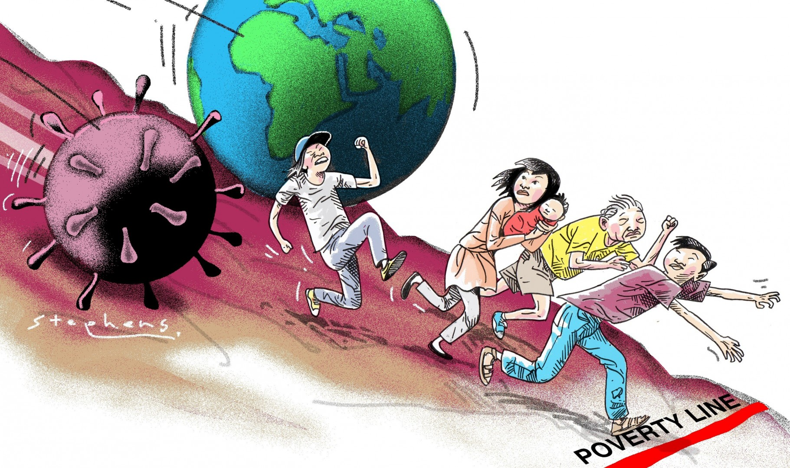

# Regression Analysis to study the spread of COVID-19

==============================

SARS-CoV-2 was first identified in December 2019 in China. This new coronavirus has caused a worldwide pandemic of respiratory illnesses known as COVID-19. It accounts for more than 31 million cases in the United States, with more than 560,576 deaths as of April 14th, 2021(1). SARS-CoV-2 can be spread very easily from person to person. The three most common ways that this can happen are direct contact and spread via droplets or aerosols. Physical distancing is considered as one of the most effective means to combat the spread of the virus, however, this measure is hard to meet in areas with high poverty where several families must live under one roof (compound houses) and/or in high density areas.

In this study, the following research question has been examined: *Is there a causal relationship between different socio-economic conditions such as poverty, unemployment rate and the number of cases related to Covid 19?* This research question is motivated by news, reports, and updates over the past 12 months about different socio-economic sections of the society affected differently and sometimes more adversely by COVID -19.

The objective here is to better understand this relationship so that health and socioeconomical policies can be implemented at the state level and help reduce the spread of COVID-19. I expect that individuals living under the poverty line and/or people living in high-density areas are going to have more COVID -19 cases. Three different models will be developed to explore our research question, additional variables such as number of homeless and face mask mandate and population density will also be included to understand their effect on the number of COVID-19 cases.

Repo Organization
------------

    ├── README.md          <- The top-level README for developers using this project.
    │
    ├── data               <- The original, immutable data dump.
    |
    ├── reports            <- Generated analysis as PDF
    │
    └── notebooks          <- .Rmd notebooks.
        │
        └── images         <- Images used
--------
